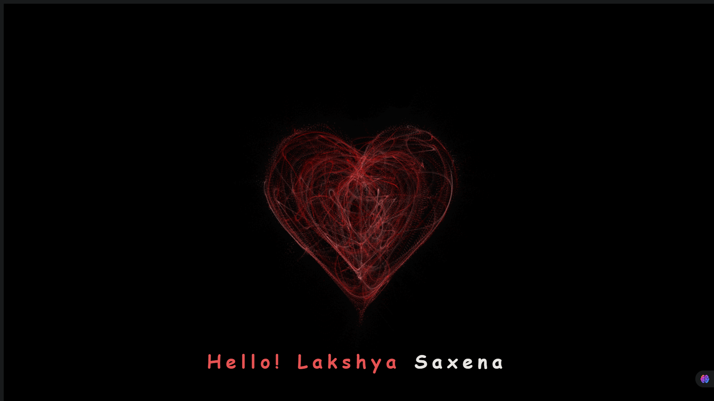

# 💖 Smoke Heart - Animated Heart

Welcome to **Smoke Heart**, a creative animated canvas project built with HTML5, JavaScript, and CSS. This interactive animation displays a pulsating heart shape made from particles, accompanied by a warm greeting message — all rendered on a canvas element.

## 🌐 Live Demo

🔗 [Click here to view the live project](https://lakshyasaxena07.github.io/Smoke-Heart/)

---

## 🎯 Features

- 🔥 Particle-based animated heart
- 📱 Fully responsive to different screen sizes
- 💻 Built using pure HTML, CSS, and JavaScript
- 🎨 Custom canvas rendering with smooth animation

---

## 🛠️ Technologies Used

- HTML5
- CSS3 *(Optional, for styling text and layout)*
- Vanilla JavaScript
- `<canvas>` API

---

## 🚀 Getting Started

To run this project locally:

```bash
git clone https://github.com/lakshyasaxena07/Smoke-Heart.git
cd Smoke-Heart
open index.html   # or use Live Server in VS Code
```

## ✨ Preview



---

## 📜 License

This project is licensed under the MIT License - see the [LICENSE](LICENSE) file for details.
---

## 🧑‍💻 Author

**Lakshya Saxena**  
🎓 2nd Year B.Tech CSE (AI & DS) @ SISTec  
💼 Member, Kaggle Koders Committee  
📍 Bhopal, India  
🌐 [Portfolio](https://lakshyasaxena07.github.io/Smoke-Heart)  
🔗 [LinkedIn](https://www.linkedin.com/in/lakshyasaxena07)  
🐱 [GitHub](https://github.com/lakshyasaxena07)


